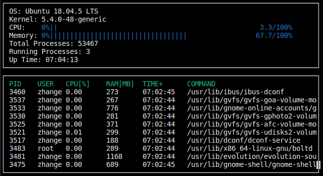

# CppND-System-Monitor

System Monitor Project in the Object Oriented Programming Course of the [Udacity C++ Nanodegree Program](https://www.udacity.com/course/c-plus-plus-nanodegree--nd213). 

## ncurses
[ncurses](https://www.gnu.org/software/ncurses/) is a library that facilitates text-based graphical output in the terminal. This project relies on ncurses for display output.

Within the Udacity Workspace, `.student_bashrc` automatically installs ncurses every time you launch the Workspace.

If you are not using the Workspace, install ncurses within your own Linux environment: `sudo apt install libncurses5-dev libncursesw5-dev`

## Make
This project uses [Make](https://www.gnu.org/software/make/). The Makefile has four targets:
* `build` compiles the source code and generates an executable
* `format` applies [ClangFormat](https://clang.llvm.org/docs/ClangFormat.html) to style the source code
* `debug` compiles the source code and generates an executable, including debugging symbols
* `clean` deletes the `build/` directory, including all of the build artifacts

## Screenshot

## reference

* converting time to string http://cplusplus.com/reference/ctime/localtime/
* calculating cpu util https://stackoverflow.com/questions/41224738/how-to-calculate-system-memory-usage-from-proc-meminfo-like-htop/41251290#41251290
* calculating process cpu util https://stackoverflow.com/questions/16726779/how-do-i-get-the-total-cpu-usage-of-an-application-from-proc-pid-stat/16736599#16736599